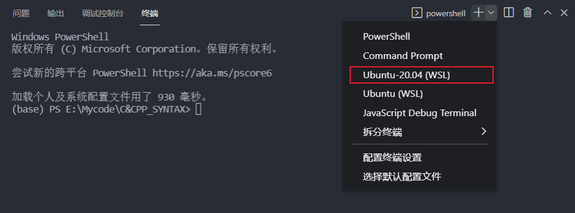
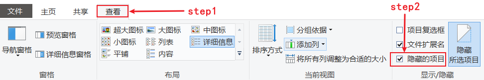
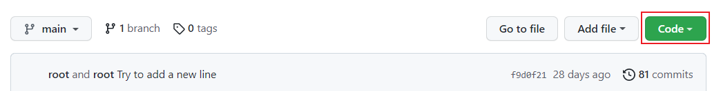
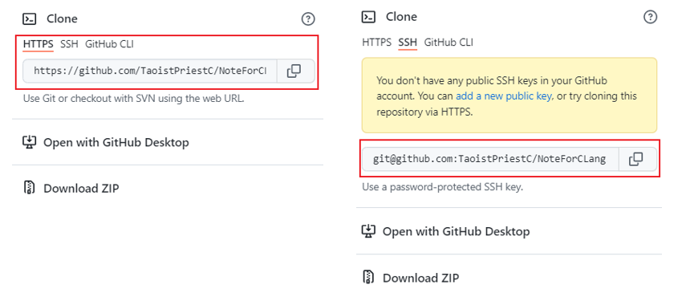
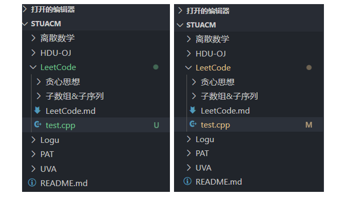
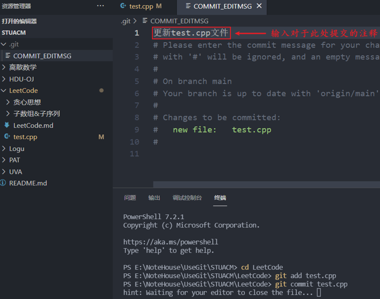

### (一)搭建工作环境

#### **(1.1)使用WSL模拟Linux环境**

　　使用 [WSL](https://docs.microsoft.com/zh-cn/windows/wsl/install) 而非 [Windows+MinGW](https://sourceforge.net/projects/mingw/) 好处在于能从Windows环境得到类似的Linux开发的经验。直接打开微软应用商店搜索 [Ubantu 20.04 LTS](https://zhuanlan.zhihu.com/p/135873643) 即可，安装完成则要新建一个用户，然后 [更换镜像源](https://zhuanlan.zhihu.com/p/142014944)，出于方面执行需要权限的命令，打开Powershell，修改默认用户，将其设为管理员。

```bash
## 对于Ubuntu 18.04 LTS 进行设置管理员为默认用户
ubuntu1804.exe config --default-user root
## 对于Ubuntu 20.04 LTS 进行设置管理员为默认用户
ubuntu2004.exe config --default-user root 
## 以此类推...
```

　

#### **(1.2)使用VS-Code编写代码**

　　安装VS Code之后，下载C/C++插件、Remote-WSL插件，然后选择 Ubantu 20.04 LTS 并在命令行输入下列命令，便可安装一系列软件包，包括 `gcc`、`g++` 和 `make`，这是C/CPP开发环境最基本的工具。

<div align=center>
    
</div>

```bash
sudo apt update
sudo apt install build-essential
sudo apt install aptitude
```
　　接下来安装调试所需的`gdb`工具，在此之前，先装一个 `aptitude`，这是因为Linux环境下载工具经常出现依赖项缺失， `aptitude` 能够自动分析并解决依赖项，可将其视为类似 `conda`、`npm` 一类的包管理工具。为免下载 `gdb` 过程可能的各种问题，下面改用`aptitude`下载 `gdb`工具，安装完成之后，环境搭建宣告完成！

```bash
sudo aptitude install gdb
```

　

#### (1.3)使用Git管理内容与版本

　　首先Git能够帮助我们进行内容管理，以及版本管理，所谓内容管理，而被其管理的文件夹又称 “仓库”，首先下载Git工具，并在VS Code里面安装GitLens插件。完成之后，若想新建一个仓库，直接打开某个文件夹，直接右键选择`Git Bash Here`，然后键入`git init`即可，此时文件夹会多出一个`.git`隐藏文件，如果看不到可以在文件系统的查看选项卡中修改。只要文件夹里面带有`.git`文件，说明项目已经变成了一个代码仓库，内容管理与版本管理都已经开启了。本地仓库能在本地进行内容与版本的管理，做好之后再上传GitHub即可，在本地受管理的项目则被称为本地仓库。建在GitHub上面的称为远程仓库。

<div align=center>
    
</div>

　　我们点击GitHub主页右上角的加号 `+` 按钮，选择 `New repository` 新建仓库，我们GitHub上面建立的仓库称为远程仓库，进入仓库之后点击绿色的`Code`按钮。

<div align=center>
    
</div>

　　我们能把远程仓库整个项目克隆到本地，远端克隆到本地的项目会默认生成`.git`文件，本地仓库与远程仓库是可以进行同步的，你可以把你对本地仓库的修改提交，同步上传到远程仓库，利用这一点特性，即便不做项目，也可以使用GitHub管理自己的本地一大堆markdown笔记。通常提交修改只需要用到 `add`、`commit`、`push` 三个命令。关于三条命令各自的用途会在下文讲解。

　　关于克隆项目可以选用HTTPS或SSH协议，本人经常使用HTTPS协议，因为比较方便，其实也可以直接下载压缩包，此处我们使用git工具，复制协议相应的链接，然后键入下列命令，注释部分是终端返回的信息，可见已经项目克隆成功。

<div align=center>
    
</div>

```bash
git clone https://github.com/TaoistPriestC/STUACM.git

# Cloning into 'STUACM'...
# remote: Enumerating objects: 270, done.
# remote: Counting objects: 100% (270/270), done.
# remote: Compressing objects: 100% (250/250), done.
# remote: Total 270 (delta 119), reused 3 (delta 2), pack-reused 0
# Receiving objects: 100% (270/270), 217.60 KiB | 51.00 KiB/s, done.
# Resolving deltas: 100% (119/119), done.
```


　　项目克隆到本地之后，使用VS Code打开，随便点击一个文件夹，在里面新建一个`test.cpp`文件，此时文件会变成绿色，显示图标`U`，代表Untrack，文件未被跟踪。未被跟踪的文件，是不跟踪每一次的修改记录的，也即对此文件没有版本控制，而在使用`git add test.cpp` 命令之后，文件将被跟踪，修改文件会使其变成黄色，并有图标`M`，代表Modified，使用`git commit test.cpp` 命令会将此次的所有修改当做一条记录提交，对于这条记录我们亦能添加一些注释，下面的`COMMIT_EDITMSG` 文件红框内容即为注释。

<div align=center>
    
</div>

　　如果本地仓库与远程仓库建立了连接，那么还应使用`push`命令，关于这些命令的解释，详见下列代码，将其本地的变动推到远程，使其二者同步。使用`git status`能够查看当前已被跟踪文件的修改状态，用于查看在上次提交之后是否有对文件进行再次修改，使用`git log` 能够看到每次`commit`命令提交的记录与注释。

<div align=center>
    
</div>


```bash
# 本地仓库与远程仓库建立连接
# 远程仓库通常都命名叫做 origin, 其也能改成其它名字, 链接根据自己的仓库修改
git remote add origin https://github.com/TaoistPriestC/STUACM.git

git add --all
git commit --all
git push -u origin master
```

　　由于每次跟踪文件都要使用`add`, 每次提交修改都要`commit`, 非常麻烦!因而不妨批量创建文件, 或是大幅修改之后, 再用` --all` 参数对项目的所有文件生效，完成以上步骤之后，最后再用`push`命令把本地仓库的变动全部同步于远程仓库，不过`push`过程极有可能遇到下列的报错。这种情况可能是网络波动引起的，可以尝试更换网络环境，或者按下`Ctrl+C`取消命令，然后多试几次，[此处](https://www.cnblogs.com/fairylyl/p/15059437.html)针对几种常见的情况总结了应对办法，其实多试几次一般就好了，有时候可能是因为网络高峰期而已。其余部分快速入门可以去看[狂神的网课](https://www.bilibili.com/video/BV1FE411P7B3?from=search&seid=3425856715137347591&spm_id_from=333.337.0.0)，深入学习其原理阅读[这篇笔记](https://blog.csdn.net/xiaoputao0903/article/details/23912561)，以及观看 [尚硅谷的网课](https://www.bilibili.com/video/BV1pW411A7a5?from=search&seid=3425856715137347591&spm_id_from=333.337.0.0)。

```bash
fatal: unable to access 'XXX': OpenSSL SSL_read: Connection was reset, errno 10054
```

　

#### (1.4)使用GDB调试代码

　　按照上面的步骤走下来，如果环境仍未配好可以选择[在线学习](https://www.onlinegdb.com/)，GDB并不仅仅适用于C/C++，同样可用于调试Assembly、Go、Objective-C等一系列语言。对于C/C++来说，使用GDB调试之前在编译期间加入-g参数。

```bash
gcc -g debug.c
```

　　GDB功能非常丰富，不用指望全部记住，遇到不懂的地方最好立刻查阅[官方文档](https://sourceware.org/gdb/current/onlinedocs/gdb/)，下面是一些常用的GDB命令，其中圆括号包起来的部分是命令参数。调式期间如果想要使用shell命令，只要带上`shell`前缀再写命令便能像在shell里面一样执行。不妨使用`debug.c`练习下面的命令，但是以下命令往往仅能用来调试二进制可执行文件。

|      命令      |    使用方法     |            说明            |
| :------------: | :-------------: | :------------------------: |
| set logging on | set logging on  |        开启日志记录        |
|     run/r      |       run       |          运行程序          |
|     quit/q     |      quit       |          退出调试          |
|    break/b     | break (LineNum) |          设置断点          |
|     next/n     |      next       |        单步执行语句        |
|     step/s     |      step       |        进入函数执行        |
|    print/p     |   print (Var)   |          打印变量          |
|     list/l     |      list       |          列出代码          |
|      info      |  info (Point)   | 打印断点/观察点/捕捉点信息 |

　　实际工作中经常会需要调试出错的代码文件(core dump)，或是正在运行的进程。对于前者，首先使用`ulimit -a`查看`core  `文件大小限制是多少，执行结果如下所示。如果不了解这条命令可以使用`man ulimt`查看帮助。通常来说，因为`core`文件通常比较大，而在工作环境，由于计算机是多人共享的资源，每个人使用的计算机都有一定的资源限制，默认限定`core`文件大小为零，也即默认不生成`core`文件，使用`ulimit -c unlimited`解除`core`文件大小限制，之后运行错误代码便有`core`文件生成，然后运行的时候带上相应core文件即可。

```bash
core file size          (blocks, -c) 0
data seg size           (kbytes, -d) unlimited
scheduling priority             (-e) 0
file size               (blocks, -f) unlimited
pending signals                 (-i) 7823
max locked memory       (kbytes, -l) 64
max memory size         (kbytes, -m) unlimited
open files                      (-n) 1024
pipe size            (512 bytes, -p) 8
POSIX message queues     (bytes, -q) 819200
real-time priority              (-r) 0
stack size              (kbytes, -s) 8192
cpu time               (seconds, -t) unlimited
max user processes              (-u) 7823
virtual memory          (kbytes, -v) unlimited
file locks                      (-x) unlimited
```

```bash
gdb ./a.out  core.19761
```

　　对于正在运行的进程来说，只要带上进程号即可。我们故意写一个死循环用于练习，但要注意，运行`running.c`代码的时候使用`./a.out &`，其中符号`&`代表后台运行，此时终端会返回一个进程号，再用`gdb program PID`即可，其中`PID`代表进程号，`program`可以缩写变成`-p`命令。练习结束之后即可杀掉相应的进程。

```bash
ps -ef | grep a.out
# root  1363  1270 91 10:22 tty1     00:11:40 ./a.out
# root  1372  1270  0 10:35 tty1    00:00:00 grep --color=auto a.out
kill 1363
```


### (二)编译与链接的过程


### (三)编译原理
