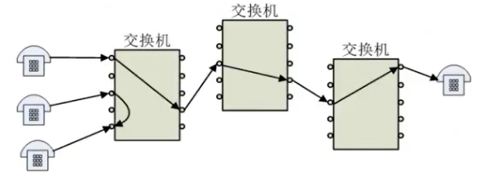
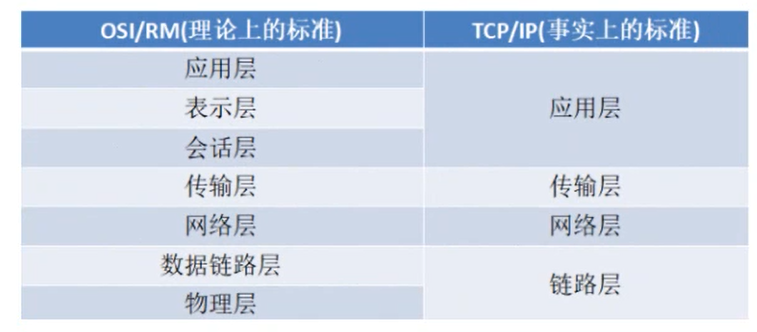
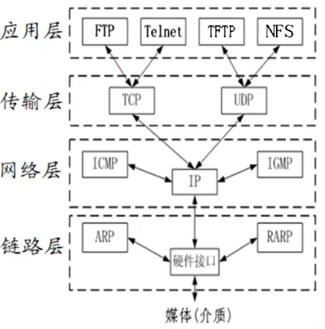
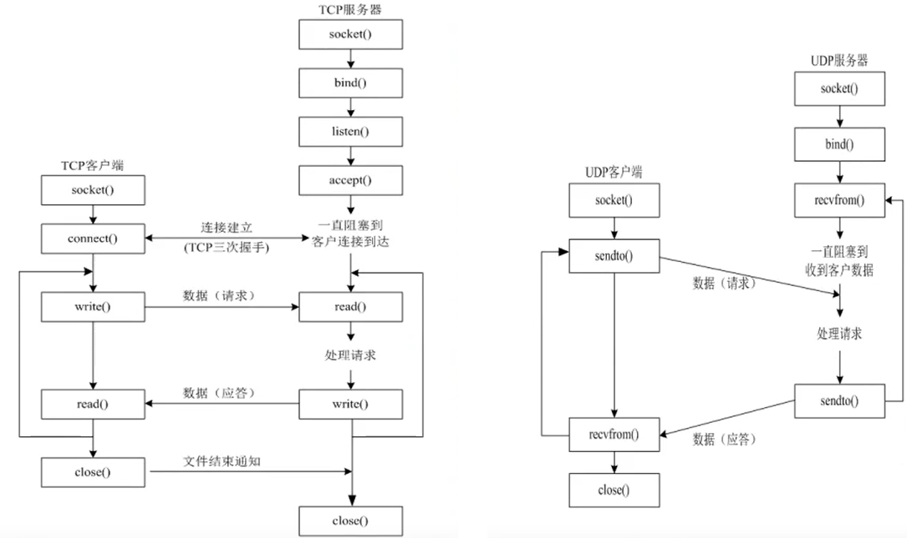

### (一)网络模型

#### **(1.1)计算机网络发展史**

　　早期的通信是基于电路交换，需要经历“建立链接→使用链接→释放链接”三个过程，链接一旦建立，物理通路便被双方独占，但是计算机数据是突发式的出现于数据链路的，因而基于电路交换的网络效率太低，不适合传输计算机数据。



　　苏联发射了第一颗人造地球卫星Sputnik之后，美国针对苏联可能带来的威胁，成立了[ARPA计划](https://www.wanweibaike.net/wiki-ARPANET)，提出了对于计算机网络的一系列要求。为了实现不同类型计算机和不同操作系统之间能够通信这个要求，人们引入了分层的概念，最早的分层体系结构是OSI开发系统互联模型，是由国际化标准组织(ISO) 制定的，但是由于七层模型太过复杂，至今也未被采用。目前广泛采用了只有四层的 [TCP/IP协议族](https://zhuanlan.zhihu.com/p/33889997)，其中应用层负责应用程序之间互相沟通，传输层提供进程之间数据传送服务，网络层提供基本数据封包传输功能，链路层负责数据帧的发送与接受。



　

#### **(1.2)各层模型与协议**

　　虽然目前广泛采用了只有四层的 [TCP/IP协议族](https://zhuanlan.zhihu.com/p/33889997)，但是七层模型仍有一定的参考价值，个别考研教辅会把二者折中，弄出一个所谓的五层模型，以便理解记忆对付[408考试](https://zhuanlan.zhihu.com/p/301171364)，但要知道，实际并没有所谓的五层模型。虽然网络已经分层，但其体系仍然庞大复杂，专家大多建议自顶向下循序渐进、有所侧重的学习实际工作所需的 [网络协议栈](https://www.cnblogs.com/sammyliu/p/5225623.html)，对于不用的内容，简单了解即可，切忌追求大而全。



　

　

#### **(1.3)网络编程准备工作**

　　这份笔记主要是讲Linux环境的网络编程，关于Windows环境的网络编程可以参考[这份教程](https://www.winsocketdotnetworkprogramming.com/winsock2programming/index.html)，国内关于Windows环境的网络编程的教程较少，工业界主要是游戏开发在用Windows平台编程。正式开始编程之前，先来捋清[字节序](https://www.cnblogs.com/LubinLew/p/ByteOrder.html)与[地址转化](https://www.cnblogs.com/wintrysec/p/10616706.html)两个概念，以及socket编程的一般流程。

　　其中的字节序主要是说小端格式与大端格式的问题，前者会把低位字节数据存储于低地址(LSB)，后者会把高位字节数据存储于低地址(MSB)，代码 `endian.c` 展示如何利用共用体 `union` 判别大小端，`trans.c` 展示了一些基本字节序转化函数的使用。网络协议制定了通讯使用大端字节序，运行在同一台计算机的进程互相通信通常是不用考虑字节序的，但是异构计算机之间的通信需要转化自身的字节序为网络字节序。其中的地址转化主要是说如何把点分十进制数转化为整形变量，其中点分十进制数具有char数组、字符串两种表达方式，将其转为整形变量之后，需要逐字节访问才能看到点分十进制数的每个数字。代码 `inet.c` 展示了二者之间的转化。

　　关于socket编程，socket是计算机之间进行通信的一种约定或一种方式，其中文翻译是套接字，初看之下，不知所云，而其英文原意是插口、插座的意思，非常形象的反应了不同实体通信的连接过程，重点掌握下图展示TCP与UDP工作流程。



　　通过 `socket()` 函数能够得到套接字的描述符，其本质是一种文件描述符，代表一个通信的管道的一个端点，其类似文件操作，能用 `read`、`write`、`close` 等函数对其进行网络数据的收取与发送。socket 具有多种类别。其中用于TCP连接的流式套接字`SOCK_STREAM`、用于UDP连接的数据报套接字`SOCK_DGRAM`、原始套接字`SOCK_RAW`三种是最为重要的三类。代码`socket.c` 演示了如何创建一个套接字。


　

### (二)应用层

#### (1.1)UDP编程

　　面向无连接的用户数据报协议，在传输数据之前无需建立连接，目的主机收到UDP报文之后，也不给出任何确认。其速度快于TCP，对于广播和多播必须使用UDP，实现简单的请求应答程序建议使用UDP，而对海量数据传输则不应该使用UDP。其中DNS域名解析，NFS网络文件系统、RTP流媒体，以及一般的语音、视频通话，采用的都是UDP协议。

　　**:fire:UDP编程流程**

| step |        服务器流程        |      客户端流程      |
| :--: | :----------------------: | :------------------: |
|  1   |   创建套接字 socket()    | 创建套接字 socket()  |
|  2   | *绑定IP/Port数据 bind()* |  发送数据 sendto()   |
|  3   |   接收数据 recvfrom()    | 接受数据 recvfrom()  |
|  4   |    发送数据 sendto()     | *关闭套接字 close()* |

　　服务器不需要关闭套接字，因为一个服务器需要响应多个客户端发出的请求。如果服务器关闭了，那么客户端便连接不上了，正如游戏服务器维护期间，玩家是无法登陆游戏的。

　　IPv4套接字地址结构相关的结构体都被放在了`<netient/in.h>` 头文件里面了，定义原地址与目标地址结构的时候，常用`sockaddr_in`结构，但在调用编程接口函数，且该函数需要传入地址的时候，必须使用`sockaddr`，因为其设计之初，为使不同地址格式能被传入套接字，地址必须强制转化变为通用套接字 `sockaddr` 结构。

```c
struct in_addr {
    in_addr_t s_addr;				// 32bit IPv4D地址
};
struct sockaddr_in {
    short int sin_family;			// 2B, 协议族  
    unsigned short int sin_port;	// 2B, 端口号  
    struct in_addr sin_addr;		// 4B, IP地址	 
    unsigned char sin_zero[8];		// 8B, 填充
};
```

```c
struct sockaddr {  
    sa_family_t sin_family;			// 地址族
    char sa_data[14];				// 包含套接字目标地址和端口信息
};
```


#### (1.2)TCP编程

　　

### (三)传输层

　

### (四)网络层

　

### (五)链路层

　


